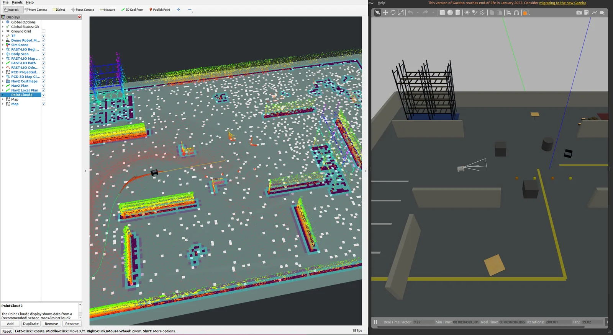
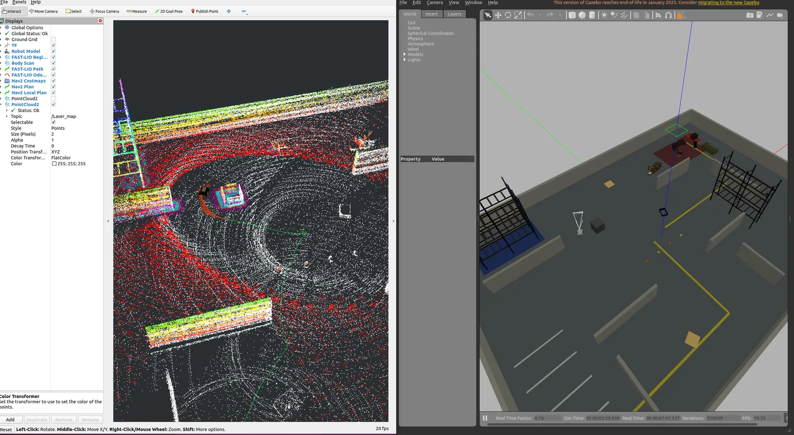

# FAST-LIO2 仿真实现有图、无图导航

  已完成
  FAST-LIO2
  Simulation
  Mapping
  Navigation

<!--
🖼 图片使用规范：
1. 本项目的图片放在当前文件夹下的 images/ 目录中，例如 images/demo.webp
2. 在正文中这样引用：
3. 全站共享的图片放在 public/images/ 目录，引用方式：
-->

## 项目概述

在自己搭建的仿真环境中运行 **FAST-LIO2**，先完成建图效果验证，再分别跑通**有图导航**和**无图导航**流程，形成一套完整的仿真实验。

  
<b>ALGORITHM</b>FAST-LIO2（建图 + 里程计）

  
<b>SENSORS</b>LiDAR + IMU

  
<b>MODES</b>有图导航 / 无图导航

  
<b>ENV</b>自建仿真环境

## 关键步骤

<ol class="steps">
  <li>搭建机器人与传感器仿真环境</li>
  <li>运行 FAST-LIO2 并验证建图效果</li>
  <li>在同一环境中完成有图和无图导航实验</li>
</ol>

## 实验与结果

### 仿真建图

<figure class="img-frame">
  
  <figcaption>FAST-LIO2 仿真建图（点击查看大图）</figcaption>
</figure>

### 有图导航

<figure class="img-frame">
  
  <figcaption>有图导航（点击查看大图）</figcaption>
</figure>

### 无图导航

<figure class="img-frame">
  
  <figcaption>无图导航（点击查看大图）</figcaption>
</figure>

## 项目产出

  <b>PROJECT OUTPUT</b>
  <ul>
    <li>仿真建图结果</li>
    <li>有图导航截图</li>
    <li>无图导航截图与流程记录</li>
  </ul>

## 参考资料

  <a href="https://gitee.com/Xz_zh/fast_lio2_xz/" target="_blank" rel="noreferrer">
    GITEE REPO
    gitee.com/Xz_zh/fast_lio2_xz ↗
  </a>

