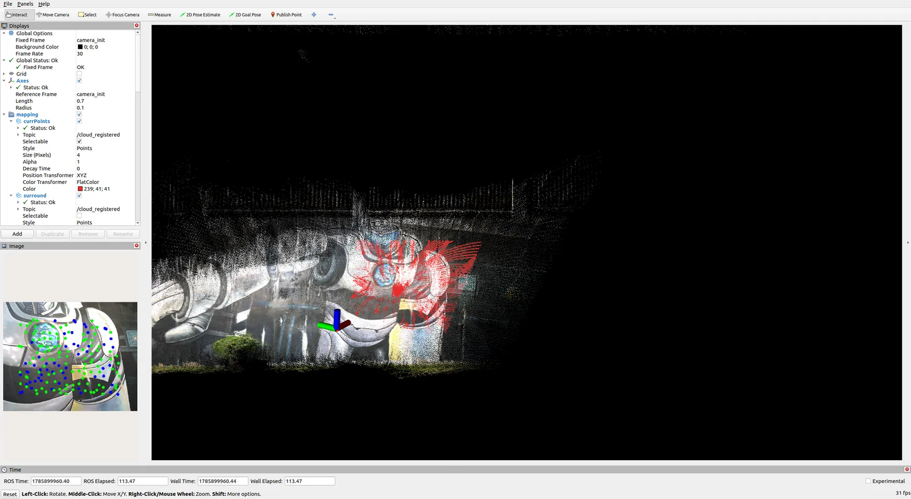
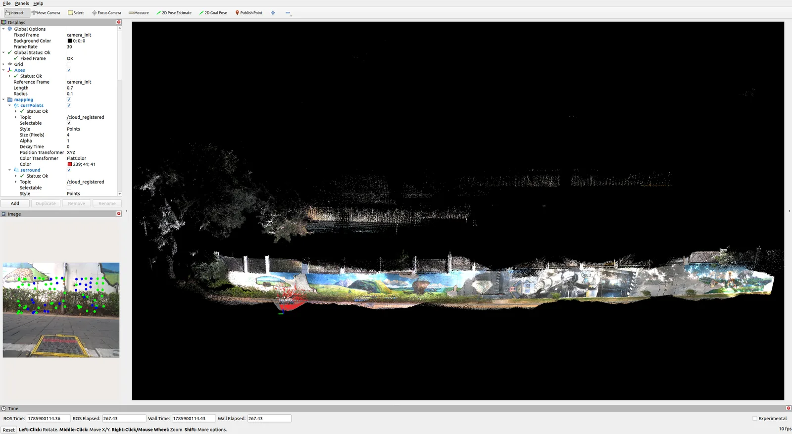

# FAST-LIVO2 复现、仿真验证与场景重建

  已完成
  FAST-LIVO2
  LiDAR
  IMU
  Vision
  Bag

<!--
🖼 图片使用规范：
1. 本项目的图片放在当前文件夹下的 images/ 目录中，例如 images/demo.webp
2. 在正文中这样引用：
3. 全站共享的图片放在 public/images/ 目录，引用方式：
-->

## 项目概述

复现 **FAST-LIVO2** 算法后，在自己搭建的仿真环境中完成建图验证；随后分别运行两组 **Bag 数据集**，得到两组重建场景。

  
<b>ALGORITHM</b>FAST-LIVO2

  
<b>SENSORS</b>LiDAR + IMU + Vision

  
<b>DATA</b>两组 Bag 数据集

  
<b>ENV</b>自建仿真环境

## 关键步骤

<ol class="steps">
  <li>完成 FAST-LIVO2 环境配置与算法复现</li>
  <li>在自建仿真环境中运行并验证建图效果</li>
  <li>运行两组 Bag 数据并输出对应场景重建结果</li>
</ol>

## 实验与结果

<figure class="img-frame">
  
  <figcaption>自建仿真环境建图验证（点击查看大图）</figcaption>
</figure>

<figure class="img-frame">
  
  <figcaption>Bag 01 · 场景重建（点击查看大图）</figcaption>
</figure>

<figure class="img-frame">
  
  <figcaption>Bag 02 · 场景重建（点击查看大图）</figcaption>
</figure>

## 项目产出

  <b>PROJECT OUTPUT</b>
  <ul>
    <li>自建仿真环境验证截图与视频</li>
    <li>两组 Bag 数据集场景重建结果</li>
  </ul>

<b>仿真视频：</b>仿真验证过程已上传 B 站：<a href="https://www.bilibili.com/video/BV1o2gG6REYe/" target="_blank" rel="noreferrer">BV1o2gG6REYe ↗</a>

## 参考资料

  <a href="https://gitee.com/Xz_zh/fast_livo2_xz/" target="_blank" rel="noreferrer">
    GITEE REPO
    gitee.com/Xz_zh/fast_livo2_xz ↗
  </a>
  <a href="https://www.bilibili.com/video/BV1o2gG6REYe/" target="_blank" rel="noreferrer">
    SIM VIDEO
    仿真验证视频（B 站）↗
  </a>

