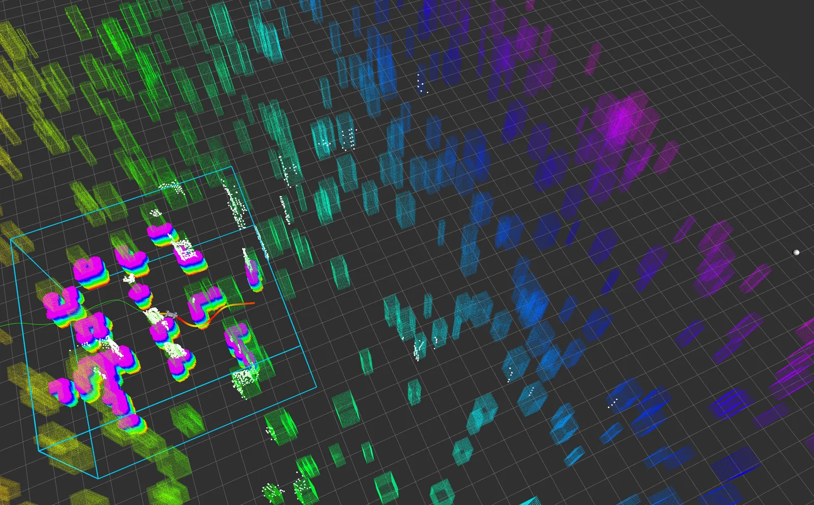

# PCT 全局规划 + Scan-Planner 局部规划融合导航

  已完成
  PCT
  SCAN-Planner
  Navigation
  RViz

<!--
🖼 图片使用规范：
1. 本项目的图片放在当前文件夹下的 images/ 目录中，例如 images/demo.webp
2. 在正文中这样引用：
3. 全站共享的图片放在 public/images/ 目录，引用方式：
-->

## 项目概述

先后复现 **PCT** 三维全局规划与 **SCAN-Planner** 局部规划，再将两类规划器融合进导航链路，完成全局路径、局部避障与导航执行的联调 Demo。

  
<b>GLOBAL</b>PCT（三维全局规划）

  
<b>LOCAL</b>SCAN-Planner（局部规划）

  
<b>TOOL</b>RViz 可视化

  
<b>STATUS</b>联调 Demo 已完成

## 关键步骤

<ol class="steps">
  <li>复现并验证 PCT 三维全局规划</li>
  <li>复现并验证 SCAN-Planner 局部规划</li>
  <li>融合两类规划器并接入导航流程完成 Demo</li>
</ol>

## 实验截图

<figure class="img-frame">
  
  <figcaption>PCT 三维全局规划（点击查看大图）</figcaption>
</figure>

<figure class="img-frame">
  
  <figcaption>SCAN-Planner 局部规划（点击查看大图）</figcaption>
</figure>

## 项目产出

  <b>PROJECT OUTPUT</b>
  <ul>
    <li>PCT 全局规划截图</li>
    <li>SCAN-Planner 局部规划截图</li>
    <li>融合导航演示视频</li>
  </ul>

<b>演示视频：</b>融合导航 Demo 已上传 B 站：<a href="https://www.bilibili.com/video/BV1d2gG6REz2/" target="_blank" rel="noreferrer">BV1d2gG6REz2 ↗</a>

## 参考资料

  <a href="https://gitee.com/Xz_zh/pct_scan_plan_xz/" target="_blank" rel="noreferrer">
    GITEE REPO
    gitee.com/Xz_zh/pct_scan_plan_xz ↗
  </a>
  <a href="https://www.bilibili.com/video/BV1d2gG6REz2/" target="_blank" rel="noreferrer">
    DEMO VIDEO
    融合导航演示视频（B 站）↗
  </a>

