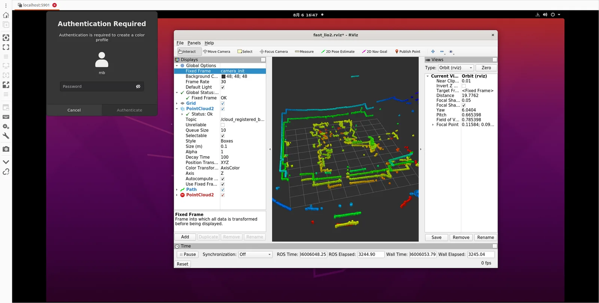
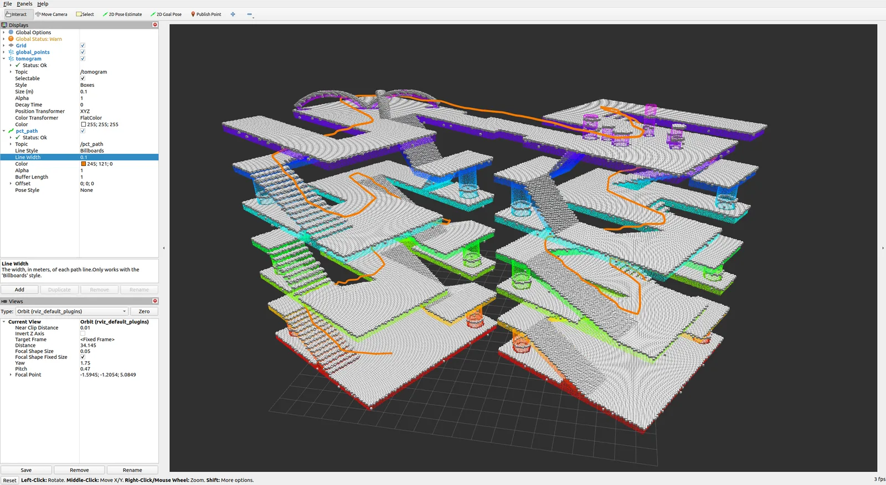
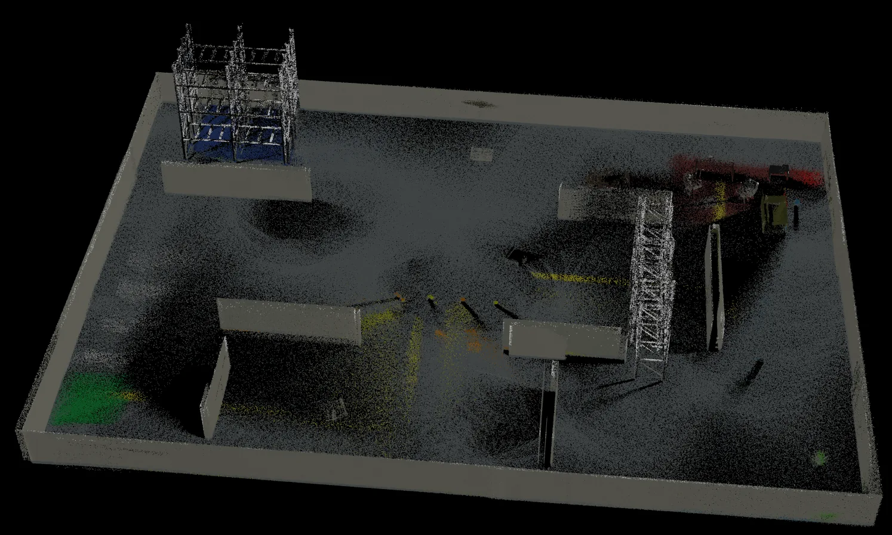
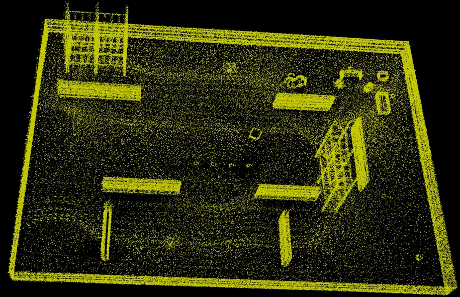

  
PROJECT ARCHIVE · 6 CASES

  <h1>项目 Projects</h1>
  
这里记录我做的一些 SLAM 小项目，每个项目一个独立文件夹，配图放在各自的 <code>images/</code> 目录。

  
<b>6</b>独立项目

  
<b>2</b>进行中

  
<b>4</b>已完成

  
<b>4</b>含图文记录

<b>🔒 访问提示：</b>项目总览公开可访问；点击进入各项目的<b>详情页</b>需要输入密码查看。

<article class="project-tile">
  <a class="project-tile__cover project-tile__cover--placeholder ph-go2" href="./GO2-rslidar-16-fast-sam/">
    GO2 · RSLIDAR · FASTSAM
    进行中
  </a>
  

    <h3><a href="./GO2-rslidar-16-fast-sam/">GO2 + rslidar 16 FAST-SAM 仿真实验</a></h3>
    
搭建宇树 Go2 仿真环境，配置 RSLiDAR 16 线激光雷达，探索 FastSAM 语义感知接入。

    

      Unitree Go2
      FastSAM
    

    

      <a class="tile-more" href="./GO2-rslidar-16-fast-sam/">查看详情 <b>→</b></a>
    

  

</article>

<article class="project-tile">
  <a class="project-tile__cover" href="./FAST-LIO2-RTK/">
    
    进行中
  </a>
  

    <h3><a href="./FAST-LIO2-RTK/">FAST-LIO2 真机部署与 RTK 扩展</a></h3>
    
使用 RSLiDAR 16 线激光雷达进行 FAST-LIO2 真机部署，规划接入 RTK 完善定位链路。

    

      FAST-LIO2
      RSLiDAR 16
      RTK
    

    

      <a class="tile-more" href="./FAST-LIO2-RTK/">查看详情 <b>→</b></a>
      

        <a href="https://gitee.com/Xz_zh/fast_lio2_xz/" target="_blank" rel="noreferrer">Gitee ↗</a>
      

    

  

</article>

<article class="project-tile">
  <a class="project-tile__cover" href="./PCT-Scan-Planner/">
    
    已完成
  </a>
  

    <h3><a href="./PCT-Scan-Planner/">PCT 全局 + Scan-Planner 局部融合导航</a></h3>
    
复现 PCT 三维全局规划与 SCAN-Planner 局部规划，融合进导航链路完成联调 Demo。

    

      PCT
      SCAN-Planner
      Navigation
    

    

      <a class="tile-more" href="./PCT-Scan-Planner/">查看详情 <b>→</b></a>
      

        <a href="https://gitee.com/Xz_zh/pct_scan_plan_xz/" target="_blank" rel="noreferrer">Gitee ↗</a>
        <a href="https://www.bilibili.com/video/BV1d2gG6REz2/" target="_blank" rel="noreferrer">视频 ↗</a>
      

    

  

</article>

<article class="project-tile">
  <a class="project-tile__cover" href="./FAST-LIVO2/">
    
    已完成
  </a>
  

    <h3><a href="./FAST-LIVO2/">FAST-LIVO2 复现、仿真验证与场景重建</a></h3>
    
复现 FAST-LIVO2，在自建仿真环境验证建图，并运行两组 Bag 数据完成场景重建。

    

      FAST-LIVO2
      LiDAR+IMU+Vision
    

    

      <a class="tile-more" href="./FAST-LIVO2/">查看详情 <b>→</b></a>
      

        <a href="https://gitee.com/Xz_zh/fast_livo2_xz/" target="_blank" rel="noreferrer">Gitee ↗</a>
        <a href="https://www.bilibili.com/video/BV1o2gG6REYe/" target="_blank" rel="noreferrer">视频 ↗</a>
      

    

  

</article>

<article class="project-tile">
  <a class="project-tile__cover" href="./FAST-LIO2-no-map-navigation/">
    
    已完成
  </a>
  

    <h3><a href="./FAST-LIO2-no-map-navigation/">FAST-LIO2 仿真有图、无图导航</a></h3>
    
在自建仿真环境中运行 FAST-LIO2，验证建图并跑通有图导航与无图导航流程。

    

      FAST-LIO2
      Simulation
      Navigation
    

    

      <a class="tile-more" href="./FAST-LIO2-no-map-navigation/">查看详情 <b>→</b></a>
      

        <a href="https://gitee.com/Xz_zh/fast_lio2_xz/" target="_blank" rel="noreferrer">Gitee ↗</a>
      

    

  

</article>

<article class="project-tile">
  <a class="project-tile__cover project-tile__cover--placeholder ph-carto" href="./Cartographer/">
    CARTOGRAPHER
    已完成
  </a>
  

    <h3><a href="./Cartographer/">Cartographer 仿真验证与真机部署</a></h3>
    
早期建图项目：先在仿真环境中验证 Cartographer，再部署到真实机器人实现建图效果。

    

      Cartographer
      2D SLAM
    

    

      <a class="tile-more" href="./Cartographer/">查看详情 <b>→</b></a>
    

  

</article>

## 如何新增一个项目

<ol class="steps">
  <li>在 <code>SLAM/Projects/</code> 下新建文件夹，例如 <code>my-new-project/</code></li>
  <li>在其中创建 <code>index.md</code>（可参考其他项目的模板结构），并新建 <code>images/</code> 目录放配图</li>
  <li>在本文档的“项目列表”中加上卡片，并在 <code>.vitepress/config.mts</code> 的侧边栏中登记</li>
</ol>
